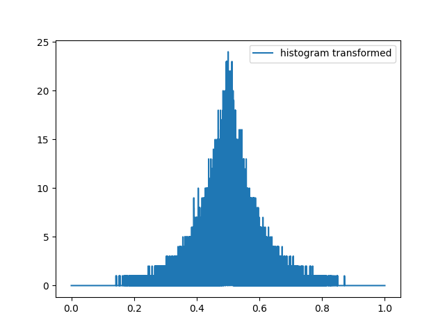

# Random Stuff

Some random stuff I've played with

### Butterfly

A simple python code that draws a butterfly with colored circles.

### Mandelbrot set

A simple python code that draws the mandelbrot set.

### Random Normal Distribution

A simple function that transforms a uniform random distribution to a distribution similar to a normal distribution.

It is not precise because it was made just for a game.

